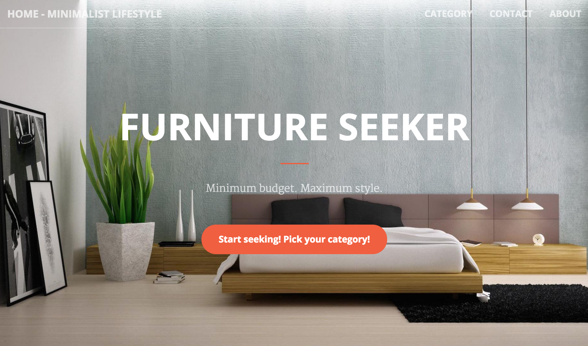
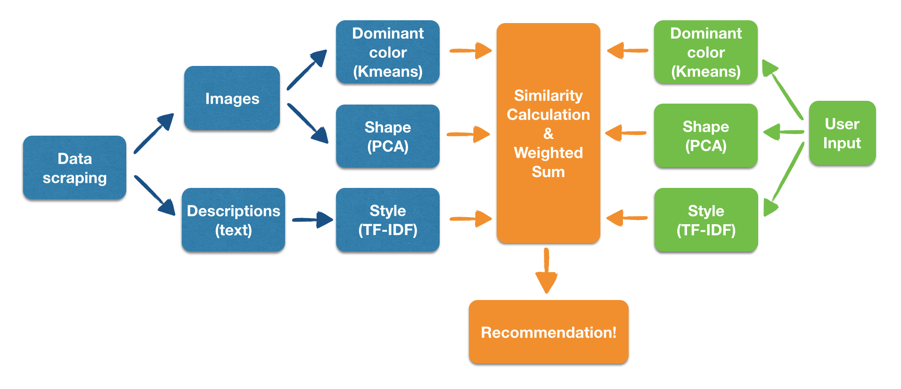
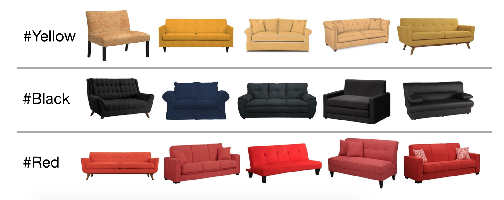
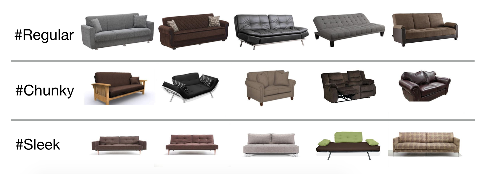
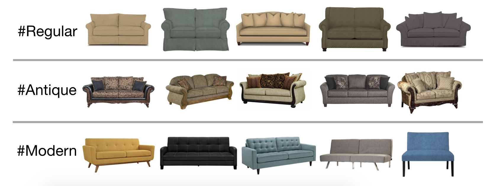
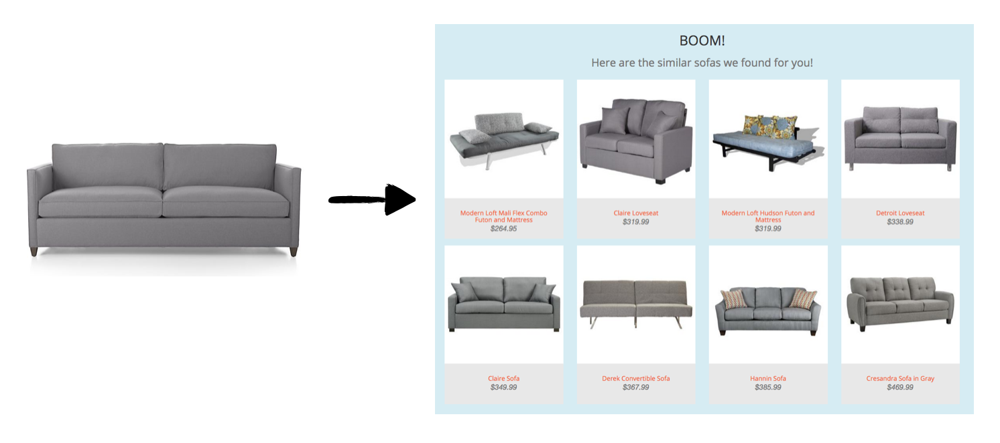

# Furniture seeker
Galvanize capstone project - Lili Yao


## TL;DR
It often happens that people find a piece of furniture online which they really like, but unfortunately out of their budget. At these times, Furniture Seeker will come in handy and present similar but more budget-friendly ones. The Furniture Seeker takes input of images URL and/or description of the target furniture, then vectorizes the information (with k-means clustering, PCA and TF-IDF) and recommends the most similar items from the furniture database.

Check out my webapp here: [FurnitureSeeker.info](http://www.furnitureseeker.info/)
<a href="http://www.furnitureseeker.info/">
</a>

## Data source
All furniture data are scraped from Wayfair.com. Wayfair is an e-commerce website with a great variety of furniture styles and prices. In total, I scraped more than 10,000 pieces of furnitures and 50,000 images. The following information are scraped for each item: product title, price, URL, category, description, ratings, images etc.


## Data pipeline


### Image processing:
Firstly, images with white background are selected. For all those images, I did the following vectorization:

* Kmeans:

    For each image, I did Kmeans clustering of the color vector of all pixels. The centroids represent the dominant colors of the image. The not-perfectly-white dominant color is then the dominant color of the furniture.

    With each vectorization algorithm, I did Kmeans clustering to visualize the vectorization results. Here are the example results of Kmeans clustering on dominant color vector:


* PCA:

    I resized and gray-scaled all images and did PCA on the image vectors. Before PCA the 150px * 150px image vector has 22,500 dimensions. With PCA I reduce the image vectors to 100 dimensions but still captured more than 90% of the variance. I found out that PCAed image vectors can capture the general shape info of the furniture. Here are the example results of Kmeans clustering on image vectors after PCA:


### Text processing:
* TF-IDF:

	For all product descriptions, I did TF-IDF to vectorize the text. The TF-IDF vectors are found to capture some style/material info of the furniture. Here are the example results of Kmeans clustering on TF-IDF vectors:


### User input processing:
User can input an image URL and/or the description of the target furniture. The webapp will performed the same vectorizations to images and text as described above. Then similarity scores will be calculated for each type of vectorization. And total similarity scores will be calculated as a weighed sum of dominant color, shape and style similarities. The eight most similar items in the database will be presented in the webapp, sorted by prices.
	


## Repo Structure
```
.
├── model
|   ├── pyimage (module implemented by Jeffrey Tang for basic image processing)
|   ├── helper.py
|   ├── image_processing.py
|   ├── text_processing.py
|   └── vectorization_db_builder.py
├── scraper
|   └── wayfair_scraper.py
├── web_app
|   ├── data
|   ├── models
|   ├── static
|   ├── templates
|   ├── app.py
|   ├── image_processing_app.py
|   └── recommender.py

```


## Package used
* numpy
* pandas
* sklearn
* skimage
* nltk
* scipy
* urllib
* threading
* BeautifulSoup
* flask
* pyimage (by Jeffrey Tang)


## Web app


## Code walk-through